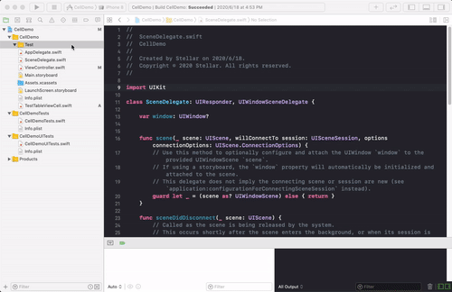

# Xcode自定义模板
Xcode提供自定义模板功能，可以对同一类型的功能，根据模板来创建多个相关代码文件，用于快速开发及统一开发规范。

## 如何使用

`此模板为个人使用，里面有很多依赖缺失。仅做说明展示，供参考.`

1. cd ~/Library/Developer/Xcode/Templates
2. git clone git@github.com:xx-li/CustomTemplates.git
3. restart xcode
4. open project and creat file
5. choice iOS -> CustomTemplates -> ListPage -> Next
6. input `New ListPage Name` -> Next -> Create

